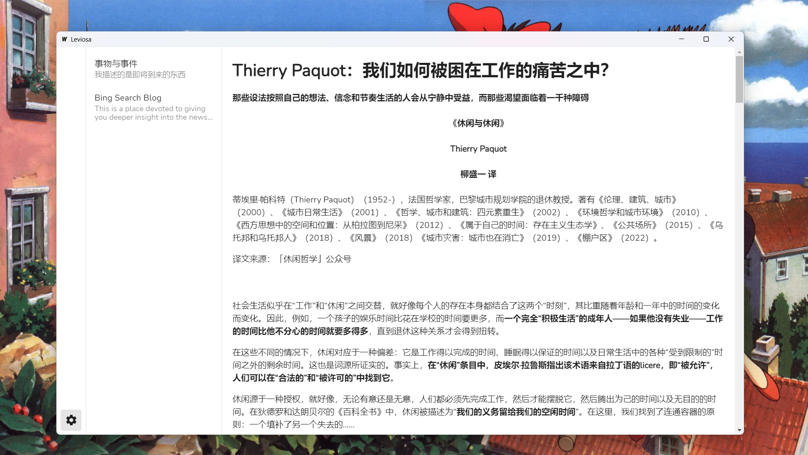

<h1 align="center">Leviosa</h1>

  <strong>Yet another desktop RSS feed reader</strong> 
  Just for fun and learning🚀~ 

> **Please Note**: The project is still at an early dev stage. It doesn't cover all basic functions of a regular RSS Feed Reader yet.

## Features

+ A single, easy-to-use desktop application.
+ What you subscribe stays in your local device.
+ Cross-platform thanks to [Wails](https://wails.io/)!

## Tools We Use

+ [Vuetify](https://vuetifyjs.com/): a wonderful Vue Component Framework.
+ [Wails](https://wails.io/): it allows us to build this cross-platform project using Golang.
+ [SQLite](https://www.sqlite.org/index.html)

## TODO

- [ ] Add Tag Management
- [ ] Add Unread Bubble
- [ ] Add Feed Management
- [ ] Add favorite list
- [ ] Improve UI